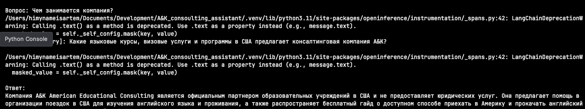
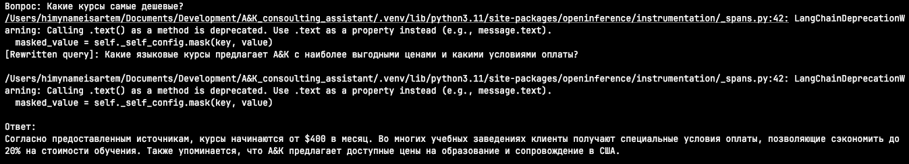
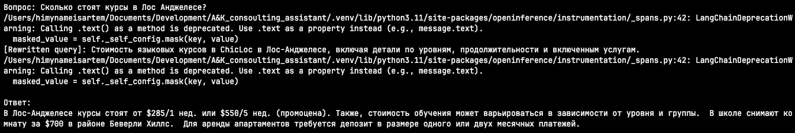
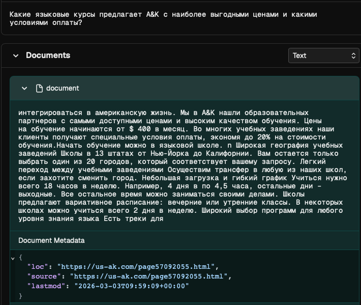
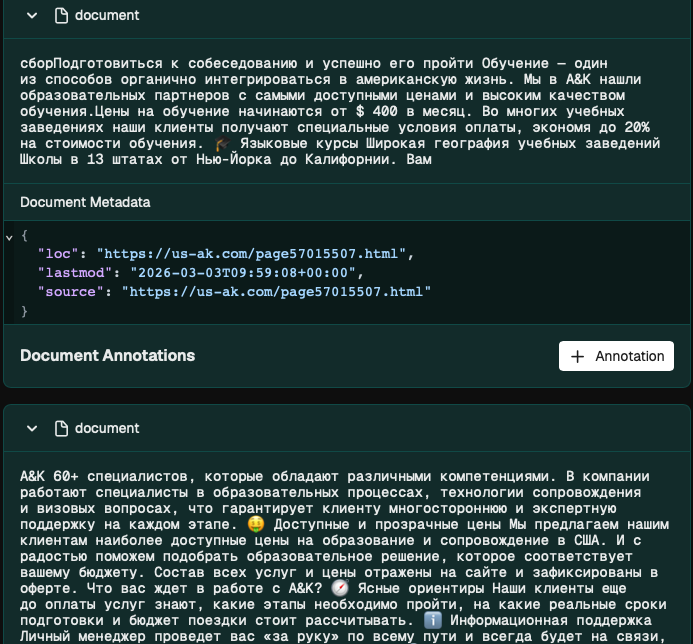

# A&K Consulting Assistant

## Table of Contents
- [English](#english)
  - [Overview](#overview)
  - [Features](#features)
  - [How It Works](#how-it-works)
  - [Project Structure](#project-structure)
  - [Run It](#run-it)
  - [Screenshots](#screenshots)
- [Русский](#русский)
  - [Обзор](#обзор)
  - [Возможности](#возможности)
  - [Как это работает](#как-это-работает)
  - [Структура проекта](#структура-проекта)
  - [Запуск](#запуск)
  - [Скриншоты](#скриншоты-1)

---

## English

### Overview
A&K Consulting Assistant is a local RAG chatbot for the A&K Consulting website. It collects content from the site, cleans and splits it into chunks, stores embeddings in Chroma, and answers user questions with a local LLM.

The project also includes:
- Phoenix tracing for observability
- query rewriting before retrieval
- a lightweight safety check in the chat flow

### Features
- Website ingestion from sitemap and recursive crawling
- HTML cleanup and chunking with overlap
- Persistent Chroma vector store
- Query rewriting for better retrieval quality
- Local LLM-based answering
- Phoenix tracing for debugging and inspection
- Simple safety check for obviously unsafe prompts

### How It Works
1. `prepare_data.py` loads pages from the A&K site.
2. The loader cleans HTML and removes boilerplate.
3. Text is split into overlapping chunks.
4. Chunks are embedded and stored in Chroma.
5. `main.py` starts the interactive chat.
6. The question is rewritten into a better search query.
7. The retriever finds relevant chunks.
8. The prompt + context are sent to the local LLM.
9. The answer is returned in the terminal.
10. Phoenix can trace the full chain when started with `--phoenix`.

### Project Structure
```text
app/
  config.py        # paths, models, constants
  embeddings.py    # embedding providers
  loaders.py       # site loading, cleaning, chunking
  llm.py           # local LLM connection
  observability.py  # Phoenix setup
  prompts.py       # answer prompt
  rag.py           # RAG chain assembly
  vetorstore.py    # Chroma vector store helpers
main.py            # interactive chat entrypoint
prepare_data.py    # offline indexing pipeline
assets/            # README screenshots
data/              # generated chunks and Chroma DB
```

### Run It
Install dependencies:
```bash
pip install -r requirements.txt
```

Prepare the index:
```bash
python3 prepare_data.py
```

Run the chat:
```bash
python3 main.py
```

Run the chat with Phoenix:
```bash
python3 main.py --phoenix
```

### Screenshots
#### Answer 1


#### Answer 2


#### Answer 3


#### Safety


#### Phoenix 1


#### Phoenix 2


---

## Русский

### Обзор
A&K Consulting Assistant - это локальный RAG-чат для сайта A&K Consulting. Проект собирает контент с сайта, очищает его, режет на чанки, сохраняет эмбеддинги в Chroma и отвечает на вопросы пользователя с помощью локальной LLM.

Также в проекте есть:
- трассировка Phoenix для observability
- переписывание запроса перед поиском
- лёгкая safety-проверка в цепочке чата

### Возможности
- Загрузка сайта через sitemap и рекурсивный обход
- Очистка HTML и разбиение на чанки с overlap
- Постоянное векторное хранилище Chroma
- Переписывание запроса для лучшего поиска
- Ответы на базе локальной LLM
- Трассировка через Phoenix
- Простая проверка на явно небезопасные запросы

### Как это работает
1. `prepare_data.py` загружает страницы сайта A&K.
2. Лоадер очищает HTML и убирает лишнюю разметку.
3. Текст режется на перекрывающиеся чанки.
4. Чанки превращаются в эмбеддинги и сохраняются в Chroma.
5. `main.py` запускает интерактивный чат.
6. Вопрос переписывается в более удачный поисковый запрос.
7. Ретривер находит релевантные фрагменты.
8. Промпт и контекст уходят в локальную LLM.
9. Ответ возвращается в терминал.
10. При запуске с `--phoenix` весь пайплайн можно трассировать в Phoenix.

### Структура проекта
```text
app/
  config.py        # пути, модели, константы
  embeddings.py    # провайдеры эмбеддингов
  loaders.py       # загрузка сайта, очистка, чанкинг
  llm.py           # подключение к локальной LLM
  observability.py  # настройка Phoenix
  prompts.py       # промпт для ответа
  rag.py           # сборка RAG-цепочки
  vetorstore.py    # помощники для Chroma
main.py            # точка входа интерактивного чата
prepare_data.py    # офлайн-пайплайн индексации
assets/            # скриншоты для README
data/              # сгенерированные чанки и база Chroma
```

### Запуск
Установить зависимости:
```bash
pip install -r requirements.txt
```

Подготовить индекс:
```bash
python3 prepare_data.py
```

Запустить чат:
```bash
python3 main.py
```

Запустить чат с Phoenix:
```bash
python3 main.py --phoenix
```

### Скриншоты
#### Вопрос 1


#### Вопрос 2


#### Вопрос 3


#### Безопасность


#### Phoenix 1


#### Phoenix 2

